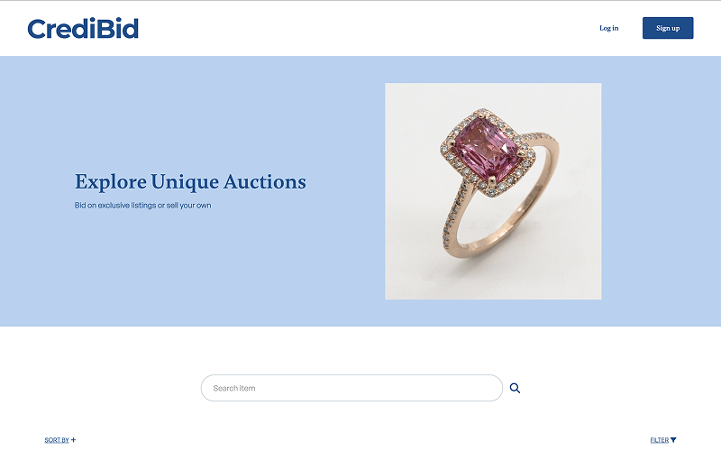

# CrediBid

## Overview

CredBid is an auction platform where users can list items for bidding and place bids on items listed by others. Each new user receives 1000 credits to use for bidding, and credits can be earned by successfully auctioning items. Non-registered users can browse listings but cannot place bids.

## Live Demo

[Deployed Application](https://credibid-auction.netlify.app/)

## Technologies Used

- JavaScript
- Vite
- HTML
- CSS (Tailwind CSS)
- Fetch API

## Features

- **User Authentication**: Users can register, log in, and log out.
- **Profile Management**: Users can update their avatar and view their total credits.
- **Auction Listings**: Users can create, browse, and search through auction listings.
- **Bidding System**: Registered users can place bids on listings and view bid history.
- **Responsive Design**: Ensures usability across different devices.

## Highlights / Unique Implementations

- **Credit System Implementation**: Users can earn credits by selling items and use credits for bidding on auction items. This feature ensures a dynamic interaction between buying, selling, and bidding.
- **Bidding System**: Developed a bidding system where registered users can place bids on auction items. The bid history is displayed, and the system ensures that only the highest bid is recorded, providing a seamless auction experience.
- **User Profile & Avatar Management**: Users can update their profiles and avatars, allowing them to personalize their accounts. This feature enhances user engagement and interaction with the platform, offering a more customized experience.
- **Responsive Design**: Utilized Tailwind CSS to implement a mobile-first, responsive design. The layout is optimized for different screen sizes, ensuring a smooth and intuitive user experience on mobile, tablet, and desktop devices.
- **Search Functionality**: Added a search feature that allows users to easily find listings by querying specific keywords. The search results are fast and accurate, providing users with the best browsing experience.

## Installation & Setup

1. Clone the repository:
   ```sh
   git clone https://github.com/H-chai/Auction-semester-project.git
   ```
2. Navigate to the project folder:
   ```sh
   cd Auction-semester-project
   ```
3. Install dependencies:
   ```sh
   npm install
   ```
4. Start the development server:
   ```sh
   npm run dev
   ```
5. Open [http://localhost:5173](http://localhost:5173) in your browser.

## Demo Account Information

To try out the demo, you can register an account using the following guidelines:

### Registration Requirements:

- **Username**: The username must not contain punctuation symbols apart from an underscore (\_).
- **Email**: The email must be a valid `stud.noroff.no` email address.
- **Password**: The password must be at least 8 characters long.

### Example Registration:

- **Username**: demo_user_1
- **Email**: demo_user_1@stud.noroff.no
- **Password**: Password123

You can use this information to log in and try out the features of the site.

## API

This project interacts with the [Noroff Auction API](https://docs.noroff.dev/docs/v2) to handle user authentication, listing creation, bidding, and profile management.

### Authentication

- **Register a new user**

  ```sh
  POST https://api.noroff.dev/auth/register

  ```

- **Login**
  ```sh
  POST https://api.noroff.dev/auth/login
  ```

### User Profile

- **Get user profile**

  ```sh
  GET https://api.noroff.dev/auction/profiles/{name}

  ```

- **Update user profile**

  ```sh
  PUT https://api.noroff.dev/auction/profiles/{name}

  ```

- **View user’s listings**
  ```sh
  GET https://api.noroff.dev/auction/profiles/{name}/listings
  ```

### Listings

- **Get all listings**

  ```sh
  GET https://api.noroff.dev/auction/listings

  ```

- **Get a single listing**

  ```sh
  GET https://api.noroff.dev/auction/listings/{id}

  ```

- **Search for listings**

  ```sh
  GET https://api.noroff.dev/auction/listings/search?q={query}

  ```

- **Create a new listing**

  ```sh
  POST https://api.noroff.dev/auction/listings

  ```

- **Delete a listing**
  ```sh
  DELETE https://api.noroff.dev/auction/listings/{id}
  ```

### Bidding

- **Place a bid on a listing**

  ```sh
  POST https://api.noroff.dev/auction/listings/{id}/bids

  ```

- **Get all bids placed by a user**
  ```sh
  GET https://api.noroff.dev/auction/profiles/{name}/bids
  ```

## Project Structure

```
/auth
  ├── login
  │   ├── index.html # Login page
  ├── register
  │   ├── index.html # Registration page
/listing
  ├── create
  │   ├── index.html # Create listing page
  ├── update
  │   ├── index.html # Update listing page
  ├── index.html # Listing page (view a listing)
/profile
  ├── update
  │   ├── index.html # Profile update page
  ├── index.html # Profile page
/public
  ├── images # Static image
/src
  ├── css
  ├── js
  │   ├── api
  │   │   ├── constants.js # API base URLs and constants
  │   │   ├── headers.js # API request headers
  │   │   ├── index.js # API request functions
  │   ├── ui
  │   │   ├── components
  │   │   │   ├── footers # Footer components
  │   │   │   ├── headers # Header components
  │   │   │   ├── listing # Listing-related UI components
  │   │   │   ├── utils # Utility functions
  │   │   ├── index.js # Main UI logic/functions
  ├── main.js # Main script file
index.html # Entry point (homepage)
style.css # Global styles
```

## Future Improvements

- **Improved Search Functionality**: Add advanced filtering options to the search function, such as category, price range, and auction deadline. This will allow users to narrow down their searches and find items more efficiently.
- **User Notifications**: Implement a notification system that alerts users about new bids on items they've placed bids on or remind them about upcoming auction deadlines. This will keep users engaged and informed in real-time.

## Screenshots

### Homepage

#### Desktop



#### Mobile


### Listing Page

#### Desktop


#### Mobile


### Profile Page

#### Desktop


#### Mobile


